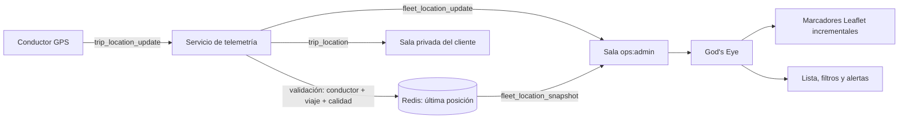

# Integración de telemetría en el panel de administración

**Objetivo:** convertir la pestaña **God's Eye** de SayTaxi en un mapa operativo que muestre, en tiempo real y con permisos estrictos, los taxis que están ejecutando viajes activos.

> El panel no debe recibir ni mostrar una flota pública completa. La primera versión debe mostrar exclusivamente conductores con un viaje `accepted` o `in_progress`, y solo a administradores autenticados. Los despachadores pueden incorporarse después con filtrado por zona y permisos explícitos.

## 1. Punto de partida del proyecto

La vista God’s Eye ya existe en `AdminDashboard.tsx`. Tiene un `LeafletMap`, consume `activeDrivers` y `activeTrips` mediante consultas administrativas protegidas y refresca datos de contexto cada 10 segundos. El componente de mapa también expone `setDrivers`, por lo que ya existe una base visual para los marcadores.

| Elemento actual | Estado | Cambio recomendado |
|---|---|---|
| `adminDashboard.activeDrivers` | Consulta protegida por `adminProcedure`, con ubicación persistida/último estado. | Mantenerla como **snapshot inicial** y respaldo al reconectar. |
| `LeafletMap.setDrivers` | Elimina y recrea todos los marcadores; centra el mapa en cada llamada. | Conservar para carga inicial, añadir actualizaciones incrementales para eventos en vivo. |
| `God's Eye` | Muestra lista, métricas y mapa. | Añadir estado de socket, filtros y acciones de seguimiento. |
| `trip_location` | Se emite a la sala privada del viaje. | Añadir un canal operativo independiente, no reutilizar ni ampliar la sala del cliente. |
| `telemetry.ts` | Valida conductor, viaje y posición antes de guardar/empaquetar un evento. | Emitir una copia mínima del evento a una sala administrativa autorizada. |

## 2. Flujo de datos propuesto



El backend debe publicar dos vistas distintas de la misma muestra validada. La primera mantiene `trip_location` para los participantes de un viaje individual. La segunda, denominada aquí `fleet_location_update`, se entrega solo a `ops:admin` y contiene los datos mínimos del taxi en operación. No se debe permitir que una cuenta de cliente se una a esta sala ni que un administrador publique posiciones.

## 3. Contrato de sockets para operaciones

### 3.1 Unión a la sala operativa

Al abrir la pestaña God’s Eye, el navegador del administrador se conecta con su sesión normal y solicita la suscripción.

```ts
socket.emit("join_operations_tracking", { scope: "active_trips" });
```

El servidor debe ignorar el `scope` enviado por el navegador como decisión de autorización. Debe derivar identidad, rol y cuenta activa exclusivamente desde `socket.data.user`, que ya establece el middleware autenticado de SayTaxi.

```ts
socket.on("join_operations_tracking", async () => {
  if (user.role !== "admin") {
    socket.emit("operations_error", { code: "FORBIDDEN" });
    return;
  }

  socket.join("ops:admin");
  await telemetry.sendAdminSnapshot(socket);
});
```

En la primera versión solo el rol `admin` puede entrar. Para incorporar `dispatcher` más adelante, la comprobación debe consultar el perfil `dispatchers`, su estado activo, sus permisos y la zona asignada antes de unirlo a una sala como `ops:dispatch:{zoneId}`.

### 3.2 Snapshot inicial

El snapshot evita que el panel espere al siguiente evento GPS. La fuente debe ser Redis, que ya mantiene la última posición por viaje con TTL.

```ts
socket.emit("fleet_location_snapshot", {
  generatedAt: "2026-08-16T18:15:00.000Z",
  vehicles: [
    {
      tripId: 1842,
      driverId: 92,
      driverName: "María Torres",
      vehicleLabel: "Toyota Corolla · ABC-123",
      tripStatus: "in_progress",
      position: {
        lat: 19.43261,
        lng: -99.13321,
        accuracyM: 12,
        headingDeg: 85,
        speedMps: 9.3,
        capturedAt: "2026-08-16T18:14:58.000Z"
      },
      serverReceivedAt: "2026-08-16T18:14:58.120Z",
      stale: false
    }
  ]
});
```

El servidor debe construir ese snapshot con la relación actual entre `tripId`, conductor y estado de viaje. No debe confiar en una clave Redis si el viaje ya fue cancelado, completado o reasignado.

### 3.3 Actualizaciones y fin de seguimiento

| Evento | Emisor | Destinatario | Propósito |
|---|---|---|---|
| `fleet_location_snapshot` | Servidor | Administrador que se suscribe | Carga inicial o recuperación tras reconexión. |
| `fleet_location_update` | Servidor | `ops:admin` | Actualiza la ubicación de un taxi con viaje activo. |
| `fleet_location_stale` | Servidor | `ops:admin` | Señala falta de señal GPS reciente. |
| `fleet_tracking_ended` | Servidor | `ops:admin` | Elimina el taxi del mapa cuando termina/cancela el viaje. |
| `operations_error` | Servidor | Socket solicitante | Informa intento no autorizado sin revelar datos operativos. |

La carga de `fleet_location_update` debe ser mínima. Evita nombres de cliente, teléfono, direcciones completas o trayectoria histórica; God’s Eye solo necesita identidad operativa del conductor, vehículo, estado, posición, precisión, hora y `tripId` para abrir un detalle bajo demanda.

## 4. Adaptación del servicio de telemetría

Después de validar y emitir `trip_location` a la sala privada del viaje, el servicio puede emitir una versión reducida a operaciones.

```ts
io.to("ops:admin").emit("fleet_location_update", {
  tripId: payload.tripId,
  driverId: trip.driverId,
  sequence: payload.sequence,
  tripStatus: trip.status,
  position: payload.position,
  serverReceivedAt,
  stale: false,
});
```

El método `sendAdminSnapshot(socket)` debe iterar posiciones Redis válidas, consultar en lotes los viajes/conductores asociados y devolver solo entradas cuyo estado continúe siendo `accepted` o `in_progress`. Una opción eficiente es mantener también un conjunto Redis `telemetry:active_trips` con TTL sincronizado a cada muestra; el snapshot lee ese conjunto, recupera las claves de ubicación y depura entradas vencidas.

| Decisión | Recomendación |
|---|---|
| Fuente de posición | Redis para snapshot y eventos; MySQL solo para historial y auditoría. |
| Scope del snapshot | Solo viajes en `accepted` o `in_progress`. |
| Frecuencia de UI | Aplicar cambios visuales cada 250–500 ms como máximo, aunque lleguen más eventos. |
| Información sensible | No incluir teléfono del cliente, origen/destino exacto ni historial en la lista/mapa general. |
| Auditoría | Registrar ingreso a God’s Eye y consultas del detalle de viaje. |

## 5. Hook del cliente administrativo

Conviene crear un hook independiente, por ejemplo `client/src/hooks/useAdminLiveTracking.ts`, y no reutilizar `useSocket`. El hook de chat actual conoce una sola sala por viaje y expone funciones de llamada/mensajes; el panel necesita una suscripción global autorizada con ciclo de vida propio.

```ts
export type FleetMarker = {
  tripId: number;
  driverId: number;
  driverName: string;
  vehicleLabel: string;
  tripStatus: "accepted" | "in_progress";
  position: { lat: number; lng: number; accuracyM: number; headingDeg?: number; speedMps?: number; capturedAt: string };
  serverReceivedAt: string;
  stale: boolean;
};

export function useAdminLiveTracking(enabled: boolean) {
  const [markers, setMarkers] = useState<Map<number, FleetMarker>>(new Map());
  const [connectionState, setConnectionState] = useState<"connecting" | "live" | "reconnecting" | "offline">("offline");

  useEffect(() => {
    if (!enabled) return;
    const socket = io(window.location.origin, {
      path: "/socket.io",
      transports: ["websocket", "polling"],
      withCredentials: true,
    });

    socket.on("connect", () => {
      setConnectionState("live");
      socket.emit("join_operations_tracking", { scope: "active_trips" });
    });
    socket.on("fleet_location_snapshot", ({ vehicles }) => {
      setMarkers(new Map(vehicles.map((item: FleetMarker) => [item.driverId, item])));
    });
    socket.on("fleet_location_update", (item: FleetMarker) => {
      setMarkers(previous => new Map(previous).set(item.driverId, item));
    });
    socket.on("fleet_location_stale", ({ driverId }) => {
      setMarkers(previous => {
        const next = new Map(previous);
        const current = next.get(driverId);
        if (current) next.set(driverId, { ...current, stale: true });
        return next;
      });
    });
    socket.on("fleet_tracking_ended", ({ driverId }) => {
      setMarkers(previous => {
        const next = new Map(previous);
        next.delete(driverId);
        return next;
      });
    });
    socket.on("disconnect", () => setConnectionState("reconnecting"));
    socket.on("connect_error", () => setConnectionState("offline"));

    return () => socket.disconnect();
  }, [enabled]);

  return { markers: [...markers.values()], connectionState };
}
```

El hook debe activarse solo cuando `activeTab === "godsEye"`. Si el administrador cambia de pestaña, desconecta la suscripción y deja de procesar actualizaciones. Así se limita coste, exposición y trabajo visual.

## 6. Renderizado incremental de Leaflet

El método actual `setDrivers` borra todos los marcadores, los crea de nuevo y ejecuta `fitBounds`. Ese comportamiento es apropiado para una carga inicial, pero no para una actualización GPS: reconstruir todos los marcadores cada pocos segundos causa parpadeo y mueve el mapa que el operador esté explorando.

Añade estas capacidades al ref del mapa:

```ts
export interface LeafletMapRef {
  setDrivers(drivers: DriverMarker[]): void;             // snapshot inicial
  upsertDrivers(drivers: DriverMarker[]): void;          // actualizar/crear solo cambios
  removeDrivers(driverIds: Array<number | string>): void;
  fitDrivers(): void;                                    // solo por acción explícita
  panTo(lat: number, lng: number): void;
}
```

Internamente, reemplaza el arreglo `driverMarkersRef` por `Map<string, LeafletMarker>`. `upsertDrivers` debe buscar el marcador por `driverId`, ejecutar `marker.setLatLng()` si existe y crear uno solo si falta. También debe actualizar icono, popup y color al cambiar `tripStatus` o `stale`.

| Acción del usuario | Comportamiento del mapa |
|---|---|
| Entrar a God’s Eye | Carga snapshot y ajusta los límites una única vez. |
| Recibir ubicación | Mueve solo el marcador afectado; no recentra mapa. |
| Elegir conductor de la lista | `panTo` y abre popup del marcador seleccionado. |
| Pulsar “Ver toda la flota” | Ejecuta `fitDrivers` bajo demanda. |
| Posición obsoleta | Mantiene marcador ámbar/gris, muestra “Sin señal desde hace X s”. |
| Viaje finalizado | Retira el marcador de la capa operativa. |

## 7. Experiencia recomendada para God's Eye

La pantalla actual puede evolucionar sin reescribir su estructura principal.

| Zona | Contenido propuesto |
|---|---|
| Cabecera | Indicador `En vivo`, estado de conexión, hora de última actualización, botón de reintento y filtro de zona. |
| Mapa | Marcadores por estado: azul en viaje, verde en aproximación, ámbar si señal obsoleta y gris si se perdió conexión. |
| Panel lateral | Lista virtualizada de taxis activos con conductor, vehículo, viaje, última señal y estado. |
| Filtros | Estado de viaje, calidad GPS, zona, tiempo sin señal y búsqueda por placa/conductor. |
| Detalle contextual | Solo al seleccionar un taxi: viaje activo, hora de señal, precisión, enlace a conversación/soporte y acciones permitidas. |
| Alertas | Sin señal por más de 60 s, precisión deficiente, ruta anómala o conductor desconectado durante viaje. |

No muestres automáticamente las direcciones completas de cliente en el popup general. Si operaciones necesita ver recogida/destino, expón un panel de detalle que requiera una acción deliberada y deje un registro de auditoría.

## 8. Seguridad y privacidad

| Riesgo | Control necesario |
|---|---|
| Cliente se une a mapa de operaciones | `join_operations_tracking` verifica `user.role === "admin"` en servidor. |
| Administrador suspendido conserva socket | El middleware de autenticación valida cuenta activa y la reconexión repite la revisión. |
| Conductor inyecta datos falsos | Se conserva la validación de asignación, estado, secuencia, precisión, velocidad y frecuencia ya implementada. |
| Exposición excesiva a soporte | Lista general con datos mínimos; detalle sensible bajo acción y auditoría. |
| Ubicación desactualizada | TTL Redis, evento `stale`, etiqueta visual y retirada al terminar. |
| Panel con muchas posiciones | Límite por zona, filtros, actualización visual agrupada y marcadores incrementales. |

La sala administrativa debe seguir autenticada al igual que todas las salas existentes. Cuando se escale a varias instancias, el adapter Redis propagará los broadcasts entre procesos, pero Redis debe permanecer privado con TLS, ACL y credenciales dedicadas. [1]

## 9. Plan de implementación

| Fase | Cambio | Criterio de aceptación |
|---:|---|---|
| 1 | Añadir `join_operations_tracking` restringido a administradores y `sendAdminSnapshot`. | Un cliente recibe `FORBIDDEN`; un admin recibe solo viajes activos. |
| 2 | Emitir `fleet_location_update`, `stale` y `ended` desde telemetría. | God’s Eye recibe solo el conductor del viaje activo y lo elimina al cerrar. |
| 3 | Crear `useAdminLiveTracking` y conectar la pestaña God’s Eye. | Snapshot inicial y actualizaciones aparecen sin refrescar la página. |
| 4 | Añadir `upsertDrivers`/`removeDrivers` a LeafletMap. | Un marcador se mueve sin parpadeo ni recentrado involuntario. |
| 5 | Incorporar filtros, detalle y alertas de señal. | Operador puede localizar una placa y detectar taxis con señal obsoleta. |
| 6 | Auditar accesos y probar carga multiinstancia. | Accesos registrados; dos nodos entregan mismo evento al panel. |

## 10. Pruebas obligatorias

| Prueba | Resultado esperado |
|---|---|
| Admin entra a God’s Eye con viajes activos | Recibe snapshot sin refresco HTTP adicional. |
| Conductor publica ubicación válida | El marcador del admin se actualiza y el mapa no se recentra. |
| Cliente intenta suscripción operativa | Rechazo explícito; no recibe snapshot ni actualizaciones. |
| Viaje se completa/cancela | Se elimina la posición Redis y el panel quita el marcador. |
| Conductor deja de enviar GPS | Marcador se vuelve obsoleto tras TTL/umbral establecido. |
| Admin reconecta | Recibe snapshot nuevo y no duplica marcadores. |
| Dos instancias Socket.IO | Panel recibe eventos aunque conductor y admin estén en nodos distintos. |
| Carga de 500 conductores | UI mantiene navegación y la lista no bloquea; se aplican actualizaciones agrupadas. |

## Referencias

[1]: https://socket.io/docs/v4/redis-adapter/ "Redis adapter — Socket.IO"
