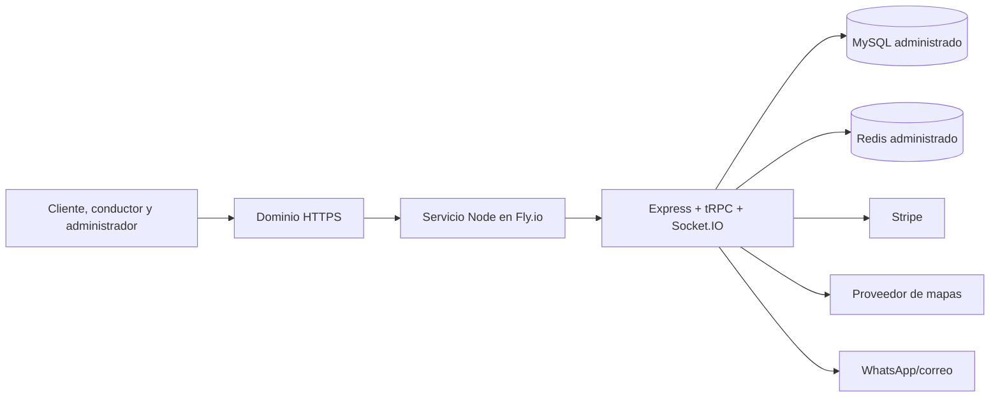

# Migración de SayTaxi sin Railway

**Autor:** Manus AI
**Objetivo:** retirar la dependencia de Railway sin perder la API Express/tRPC, autenticación, Socket.IO, telemetría GPS ni el panel God’s Eye.

## Conclusión ejecutiva

Sí, SayTaxi puede funcionar sin Railway. La opción más directa consiste en desplegar el servicio Node.js actual —Express, tRPC y Socket.IO— en una plataforma que admita procesos persistentes y WebSockets, y conservar Netlify únicamente como interfaz estática o, preferiblemente, servir la interfaz compilada desde el mismo servicio Node. Esta alternativa reutiliza la lógica existente y evita reescribir la autenticación y la telemetría.

> Netlify es adecuado para la interfaz estática, pero las conexiones persistentes de Socket.IO requieren un servicio en ejecución o una plataforma de tiempo real administrada. Netlify documenta este patrón como una combinación de funciones con un proveedor de tiempo real administrado, no como un servidor Socket.IO persistente dentro del sitio estático.[3]

## Alternativas compatibles

| Opción | Cambios al código actual | Tiempo real | Complejidad operativa | Recomendación |
|---|---|---|---|---|
| **Fly.io + MySQL/Redis administrados** | Mínimos. Mantiene Express, tRPC y Socket.IO. | Nativo mediante proceso persistente. | Media-baja. | **Recomendada para restaurar el servicio rápido.** |
| **Google Cloud Run + Cloud SQL + Memorystore** | Moderados. Requiere política de reconexión y Redis adapter. | Compatible, con timeout y reconexión. | Media-alta. | Adecuada para mayor escala y gobierno cloud. |
| **Netlify + Supabase + proveedor como Ably** | Altos. Requiere sustituir API/tRPC y Socket.IO. | Administrado por proveedor externo. | Media-alta. | Solo si se desea arquitectura serverless completa. |
| **VPS administrado con Docker** | Mínimos. Mantiene todo el servicio actual. | Nativo. | Media. | Alternativa válida si se acepta administrar actualizaciones, copias y monitoreo. |

Fly.io admite WebSockets directamente y puede publicar un servicio HTTP/HTTPS que apunta al proceso Node del proyecto.[1] Cloud Run también admite WebSockets, pero las conexiones están sujetas a timeout, deben reconectarse y las instancias múltiples necesitan sincronización externa; Google recomienda Redis Pub/Sub para Socket.IO en ese escenario.[2]

## Arquitectura recomendada para SayTaxi

La interfaz de React se compila con `pnpm build` y se sirve desde `dist/public` por el propio Express. Con este diseño, `APP_URL` y la API comparten el mismo origen; las cookies de sesión dejan de depender de CORS entre Netlify y Railway, y Socket.IO se conecta al mismo dominio. Netlify puede conservarse temporalmente como sitio informativo, pero no sería un requisito para la aplicación operativa.

## Ruta recomendada: Fly.io

La migración se divide en cuatro pasos controlados. Primero se crea una aplicación Fly a partir del repositorio actual, con `PORT` configurado y una comprobación HTTP contra `/healthz`. Fly publica los puertos HTTP/HTTPS y admite conexiones WebSocket persistentes sobre el proceso Node sin que sea necesario rediseñar el protocolo.[1]

Después se provisionan una base MySQL y Redis administrados. La base recibe las migraciones `0000` a `0004`; Redis mantiene telemetría, TTL y el adaptador Socket.IO. Las credenciales se guardan como secretos del proveedor, no en GitHub ni en archivos `.env` versionados.

En el tercer paso se define el dominio de aplicación, por ejemplo `app.tudominio.com`, con HTTPS. Se cargan `APP_URL`, `ALLOWED_ORIGINS`, `DATABASE_URL`, `REDIS_URL`, `JWT_SECRET` y la cuenta superadministradora. Como frontend y backend son el mismo servicio, `VITE_API_BASE_URL` puede dejarse vacío para conservar las rutas relativas `/api/trpc`.

Finalmente, se ejecuta el flujo completo en una subcuenta de pruebas: registro, login, solicitud, asignación, telemetría, God’s Eye y cierre de viaje. Solo después se cambia el DNS público desde Netlify/Railway al nuevo servicio.

| Variable esencial | Destino | Uso |
|---|---|---|
| `DATABASE_URL` | Servicio Node | Datos de usuarios, viajes, pagos y configuración. |
| `REDIS_URL` | Servicio Node | Telemetría y coordinación de Socket.IO. |
| `JWT_SECRET` | Servicio Node | Firma y validación de sesión. |
| `APP_URL` | Servicio Node | Dominio HTTPS público del servicio. |
| `ALLOWED_ORIGINS` | Servicio Node | Dominio de la aplicación; agrega Netlify solo mientras convivan. |
| `SUPER_ADMIN_EMAIL` y `SUPER_ADMIN_PASSWORD` | Servicio Node | Primer acceso administrativo, almacenado como secreto. |
| Stripe, mapas y mensajería | Servicio Node | Integraciones reales cuando estén disponibles. |

## Opción serverless completa

Una arquitectura exclusivamente con Netlify es posible, pero no es una migración inmediata. Se debe reemplazar el servidor Express/tRPC por funciones, mover autenticación y datos a un BaaS y sustituir Socket.IO por un servicio de mensajería como Ably. Netlify muestra este patrón con una función que emite tokens temporales y un cliente de tiempo real; la clave privada permanece en el entorno del servidor.[3]

Esta opción reduce la administración de servidores, pero introduce cambios importantes en el código y en las pruebas. No es la recomendación para corregir el login actual hoy.

## Decisión recomendada

Para recuperar el login y lanzar una beta sin Railway, selecciona **Fly.io con MySQL y Redis administrados**, sirviendo React y Express desde el mismo dominio. Después, si el negocio demanda una operación totalmente serverless, se puede planificar una migración gradual a Netlify + Supabase + Ably sin interrumpir viajes activos.

## Referencias

[1]: https://fly.io/blog/websockets-and-fly/ "Fly.io — WebSockets and Fly"
[2]: https://docs.cloud.google.com/run/docs/triggering/websockets "Google Cloud Run — Using WebSockets"
[3]: https://www.netlify.com/blog/web-sockets-in-a-serverless-world/ "Netlify — Web Sockets in a Serverless World"
